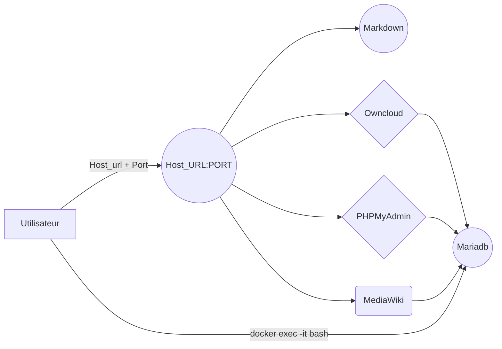

# Welcome to StackEdit!

@Author: Timothe-Renaud Langlois-Teston
@Date: Janv 2021
@docker-compose version: 3.7

# Topo:
This stack is used for personal entertainment only. Feel free to upgrade the stack with your ideas.
And also feel free to show me your upgrade.

## Installation:
```bash
mkdir MyFolder
git clone https://github.com/Timothe-Renaud/DockerStack.git
cd Dockerstack
docker-compose up
# All of the image will be downloaded if u didn't have it
#Then request the localhost:PORT or the IP_Host_of_the_machine:PORT the go on the App
```

For DB configuration:
```
On selection of database configuration select MySQL / Mariadb
DB_Login: root
DB_PASS: ex@mple
DB_name: mariadb
```


# DockerStack

This Docker Stack is used for special times only xd.
Hosting a Databse SRV with Mariadb, for the storage of the MediaWiki App & Owncloud App. You can also request tuples of the DB with the PhpMyadmin Image.
And for express documentation case, (cause your a man of documentation ) , a mini MardownEditor App is also hosted on the stack.

## Desciption:
phpmyadmin:**latest**
- port: 8081 -> 80

mariadb:**10.5**
- port: none

Mediawiki:**Latest**
- port: 8090:80
- linked to mariadb & depende to phpmyadmin
- volume - /var/www/html/images

Owncloud:**latest**
- 8080:80
- depende on phpmyadmin

MardownEditor:**Personnalmage**
- port: 1018:80
	

## Diagramme

Schema de l'architecture du stack:




## TODO
- Add Traefik.
- Make the web srv working (using personnal Dockerfile).
- Add/Enable a kibana SRV to look the logs and stuff that go in & out of the Maraidb SRV.
- Add ".env" file to help the configuration environment.
